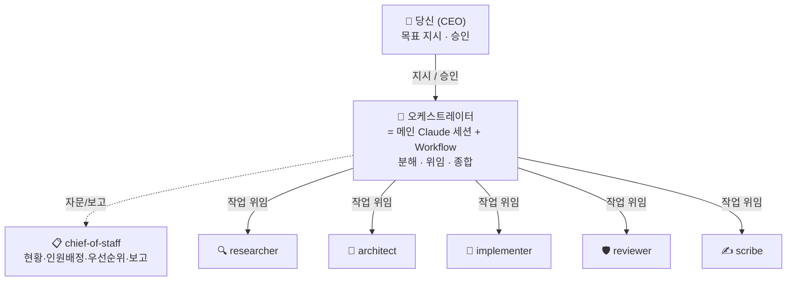
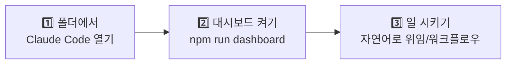
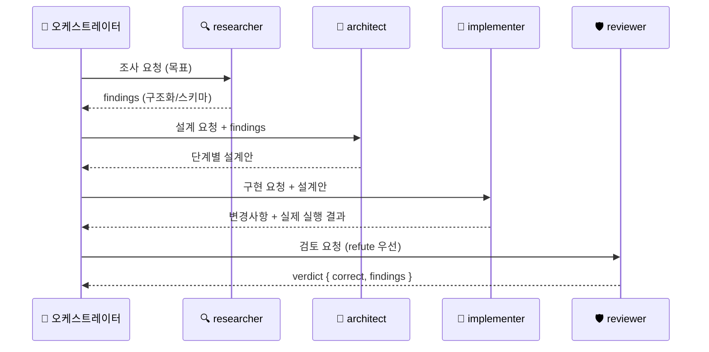
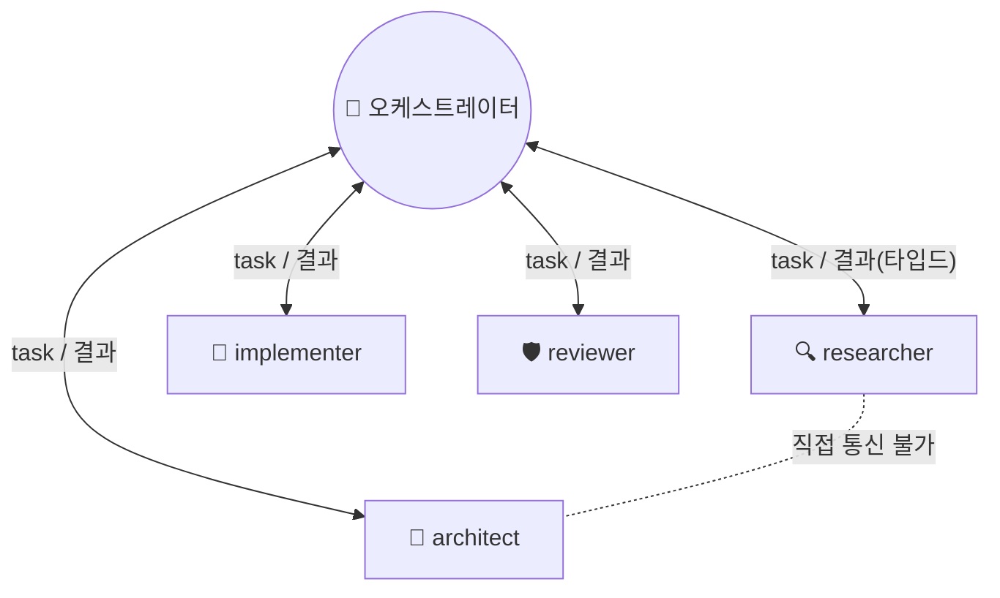
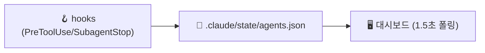
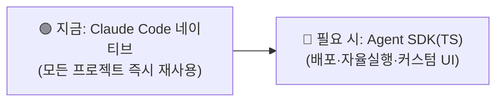
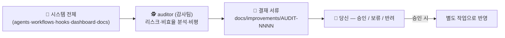

# 📖 agent-company 사용설명서

> **한 줄 요약** — `agent-company`는 Claude Code 위에 올린 **멀티 에이전트 "회사"** 입니다.
> 회사처럼 역할이 나뉜 여러 AI 직원이 협업해 소프트웨어 작업을 처리하고, 그 모습을 **실시간
> 사무실 화면**으로 볼 수 있습니다. 한 번 만들어 두면 **모든 프로젝트에서 재사용**합니다.

---

## 목차
1. [이 시스템이 무엇인가요](#1-이-시스템이-무엇인가요)
2. [전체 구조 한눈에](#2-전체-구조-한눈에)
3. [빠른 시작 (3단계)](#3-빠른-시작-3단계)
4. [직원(에이전트) 소개](#4-직원에이전트-소개)
5. [협업 프로세스(워크플로우)](#5-협업-프로세스워크플로우)
6. [에이전트는 어떻게 소통하나](#6-에이전트는-어떻게-소통하나)
7. [인원 배정(headcount)](#7-인원-배정headcount)
8. [라이브 대시보드 보는 법](#8-라이브-대시보드-보는-법)
9. [실제 사용 명령 모음](#9-실제-사용-명령-모음)
10. [전역 재사용 · MCP · 확장](#10-전역-재사용--mcp--확장)
11. [트러블슈팅 / FAQ](#11-트러블슈팅--faq)

---

## 1. 이 시스템이 무엇인가요

회사 조직처럼, **당신(CEO)** 아래에 **오케스트레이터(실행 총괄)** 와 **chief-of-staff(중간관리자)**,
그리고 역할별 **직원 에이전트**들이 있습니다.



> ⚠️ **핵심 개념** — Claude Code에서 서브에이전트는 **다른 서브에이전트를 부를 수 없습니다.**
> 그래서 위임·조율은 항상 **메인 세션(=오케스트레이터)** 이 합니다. chief-of-staff는 *계획만*
> 세우고, 실제 실행 위임은 오케스트레이터가 수행합니다.

---

## 2. 전체 구조 한눈에

```
agent-company/
├─ CLAUDE.md                  # 에이전트 운영 규칙 (세션 시작 시 자동 로드)
├─ README.md                  # 개요
├─ package.json               # npm run dashboard
├─ .mcp.json                  # MCP 서버 (github / context7 / playwright)
├─ docs/
│   ├─ 사용설명서.md          # ← 지금 이 문서
│   ├─ ARCHITECTURE.md        # 조직도·통신모델·확장경로
│   ├─ backlog.md             # chief-of-staff가 관리하는 할 일 목록
│   └─ staffing.md            # 인원 배정 기록
├─ dashboard/                 # 🎬 라이브 사무실 화면 (정적 HTML/JS)
│   ├─ index.html · app.js · styles.css
│   ├─ roster.json            # 캐릭터(아바타·성격·색·모델) 정의
│   └─ serve.mjs              # 무의존 정적 서버
└─ .claude/
    ├─ settings.json          # 권한 + hooks (hooks가 대시보드 상태 기록)
    ├─ hooks/track-agent.mjs  # 서브에이전트 상태를 state 파일에 기록
    ├─ agents/                # 👥 직원 = 역할별 subagent 정의
    │   ├─ chief-of-staff.md · researcher.md · architect.md
    │   ├─ implementer.md · reviewer.md · scribe.md
    ├─ workflows/             # ⚙️ 협업 프로세스
    │   ├─ build-feature.js · staffed-build.js · standup.js
    └─ skills/
        └─ delivery-standards/SKILL.md   # 공통 작업 기준
```

---

## 3. 빠른 시작 (3단계)



**1단계 — (전역 설치) 어디서든 호출**
`npm run promote`로 agents·workflows·skill을 `~/.claude/`에 설치하면 **모든 프로젝트의 Claude
Code 세션에서** 바로 부를 수 있습니다(이미 설치돼 있습니다). 단, **라이브 대시보드와 hook은
`agent-company` 폴더 전용**이라, 사무실 화면을 보려면 이 폴더에서 `npm run dashboard`를
실행하세요.

**2단계 — 대시보드 실행**
```bash
npm run dashboard       # → http://localhost:4317/
```
브라우저로 열고 상단 **🎬 Office view** 클릭. 기본은 **실제 작업이 있을 때만** 움직입니다
(실제 작업이 돌면 자동으로 살아납니다).

**3단계 — 일 시키기**
메인 세션에 자연어로 지시하면 됩니다. 예:
- *"architect 에이전트로 로그인 기능 설계해줘"* → 한 명에게 위임
- *"build-feature 워크플로우로 /health 엔드포인트 추가해줘"* → 전체 파이프라인
- *"chief-of-staff로 지금 현황 정리해서 보고해줘"* → 현황 보고

---

## 4. 직원(에이전트) 소개

| 역할 | 이모지 | 언제 부르나 | 도구(최소권한) | 모델 |
|---|---|---|---|---|
| **chief-of-staff** | 📋 | "현황/다음 할 일/일정/인원/보고" | Read·Grep·Glob·Bash·Write | opus |
| **researcher** | 🔍 | "찾아줘/어디 있어/어떻게 동작해" (읽기전용 조사) | Read·Grep·Glob·WebSearch·WebFetch | sonnet |
| **architect** | 📐 | "설계/접근법/비교" (코드 전 단계) | Read·Grep·Glob | opus |
| **implementer** | 🔨 | "구현/수정/버그픽스" (코드 작성+실행) | Read·Edit·Write·Grep·Glob·Bash | opus |
| **reviewer** | 🛡️ | "맞는지 검토/버그 찾기" (적대적 검증) | Read·Grep·Glob·Bash | opus |
| **scribe** | ✍️ | "문서화/배운 점 정리" | Read·Grep·Glob·Write | sonnet |
| **auditor** | 🕵️ | "시스템 자체 점검" — 감사팀; 리스크·비효율 비평 + 개선 결재 | Read·Grep·Glob·Bash·Write | opus |

> 💡 **모델 티어링** — 정확성이 중요한 역할(architect/implementer/reviewer)은 `opus`,
> 반복·읽기 위주(researcher/scribe)는 `sonnet`로 비용을 맞춥니다.

---

## 5. 협업 프로세스(워크플로우)

| 워크플로우 | 흐름 | 용도 |
|---|---|---|
| **build-feature** | 조사 → 설계 → 구현 → 검토 | 기능 하나를 끝까지 |
| **staffed-build** | 인원배정 → (역할별 N명 병렬) 조사·설계·구현·검토·문서 | 규모 큰 작업, 유동 인원 |
| **standup** | 정찰(researcher) → 브리핑(chief-of-staff) | 현황 보고 |
| **audit** | 정찰(researcher) → 감사(auditor) | 시스템 자체 점검 + 개선 결재 |

`build-feature`의 실제 메시지 흐름:



> ⚠️ 워크플로우는 **에이전트를 여러 개 띄우고 과금**됩니다. 사소한 작업엔 쓰지 말고,
> 병렬화·검증이 필요한 실질 작업에만 사용하세요(옵트인).

---

## 6. 에이전트는 어떻게 소통하나

채택한 방식은 **오케스트레이터 중재형 허브-스포크 + 구조화(schema) 핸드오프** 입니다.



| 패턴 | 특징 | 우리 시스템 |
|---|---|---|
| **허브-스포크** (채택) | 메시지 O(n), 전역 컨텍스트, 관측·제어 쉬움 | ✅ 사용 중 |
| peer-to-peer mesh | 유연하나 O(n²) 잡담, 제어 어려움 | ❌ 네이티브 불가 |
| blackboard | 개방형 탐색에 강함 | ⏳ SDK 전환 시 옵션 |

자세한 근거는 [ARCHITECTURE.md](ARCHITECTURE.md)의 "Communication model" 참고.

---

## 7. 인원 배정(headcount)

chief-of-staff가 작업의 **규모·버그위험·중요도**에 따라 역할별 인원을 **0~N명** 유동 배정합니다.

| 배정 | 기준 |
|---|---|
| **0명** | 그 역할이 필요 없음 (예: 문서 불필요 → scribe 0) |
| **1명** | 단순·단일 작업 |
| **2~4명** | 대규모/병렬가능 · 버그위험 높음 · 정확성 중요 → 슬라이스로 분할 |

`staffed-build`를 실행하면 이 계획대로 **역할별 N명이 병렬로** 일합니다. 계획은
`.claude/state/allocation.json`(대시보드용)과 `docs/staffing.md`(기록)에 저장됩니다.

---

## 8. 라이브 대시보드 보는 법

`npm run dashboard` → http://localhost:4317/ → **🎬 Office view**.

```
┌──────────────────── 🏢 사무실 평면도 ────────────────────┐
│  [🎩 Orchestrator]      ║복║      [📋 Chief of Staff]    │
│  [🔍 Researcher  ×3]    ║도║      [📐 Architect ×2]      │
│  [🔨 Implementer ×3]    ║ ✈║      [🛡️ Reviewer ×2]       │
│  [✍️ Scribe ×2]         ║  ║      [☕ Lounge]            │
└──────────────────────────────────────────────────────────┘
   ✈️ = 종이비행기(메시지)  ║복도║ = 사람들이 오감
```

**화면 읽는 법**
- 🧑‍💻 **에이전트(사람)** — 작업중이면 **타이핑 + 모니터 점등 + 머리 위 노란 표시등(점멸)**,
  일 안 하면 **흐릿(회색조) + 회색 표시등 + 💤**. 완료는 **초록 표시등 + ✓**. 한눈에 구분됩니다.
- 🏷️ **작업 캡션은 작업중일 때만** 사람 아래에 표시(예: `scan auth`) — 완료/대기면 사라집니다.
- 🗂️/📦 **서류함·완료 창고와 화면은 "현재 세션"의 작업만** 보여줍니다(세션 단위로 관리 — 전역
  누적 아님). 다른 세션의 작업이 화면을 어지럽히지 않습니다.
- ✈️ **종이비행기** — 에이전트끼리 주고받는 **메시지 1건**. 라벨에 내용(`findings`,
  `design spec`, `PR diff` …)이 적혀 있고, **여러 개가 동시에** 날아갑니다.
  - **보내는 사람** 📤 / **받는 사람** 📥(받을 때 고개 듦)
  - 비행기 색 = **보낸 부서 색** (출처 추적)
  - 출발·도착 때 천천히, 중간엔 순항 (라벨 읽기 쉽게)
- 🟡 working · 🟢 done · ⚪ idle (하단 범례)

> **모션 = 실제 작업** — 화면은 **실데이터로만** 움직입니다(별도 데모 버튼 없음). 실제
> 에이전트가 일할 때만 타이핑하고, 실제 핸드오프가 일어날 때만 종이비행기가 날며, **비행기
> 라벨에는 그 에이전트의 실제 작업 텍스트**가 붙습니다. 실제 워크플로우가 돌면 사무실이
> 환하게 살아나고, 아무 일도 없으면 다들 졸고(idle) 비행기도 없습니다 — 움직임이 곧 실제
> 활동의 신호입니다. (복도를 오가는 사람들은 상시 배경 연출입니다.)

> 동작 원리: `npm run promote`가 **전역 hook**을 `~/.claude/settings.json`에 등록하므로,
> **어느 프로젝트에서 작업하든** 서브에이전트 시작/종료와 **작업 내용**이 공용 파일
> `~/.claude/agent-company/agents.json`에 기록됩니다. 대시보드는 이 파일을 `/shared`
> 경로로 1.5초마다 폴링해서 그립니다. ⚠️ 전역 hook은 **새 세션부터** 적용됩니다.



---

## 9. 실제 사용 명령 모음

| 하고 싶은 것 | 방법 |
|---|---|
| 한 역할에 위임 | 메인 세션에 자연어: *"reviewer로 현재 변경 검토해줘"* |
| 프로세스 실행 | *"build-feature 워크플로우 실행"* (또는 staffed-build / standup) |
| 대시보드 켜기 | `npm run dashboard` → http://localhost:4317/ |
| 설정 검증 | `python -m json.tool .claude/settings.json` |
| 역할 전역 승격 | `.claude/agents/<role>.md` 를 `~/.claude/agents/` 로 복사 |

---

## 10. 전역 재사용 · MCP · 확장

**전역 재사용 (어디서든 호출)** — `npm run promote` 한 번이면 회사 전체를 `~/.claude/`에
설치해 **모든 Claude Code 프로젝트에서** 그대로 부를 수 있습니다. (claude-code-guide로 확인된
공식 위치이며, 같은 이름이면 프로젝트 정의가 전역보다 우선합니다.)

| 구성요소 | 전역 위치 | 효과 |
|---|---|---|
| 직원(에이전트) | `~/.claude/agents/*.md` | 어느 프로젝트에서든 *"researcher로 …"* 호출 |
| 워크플로우 | `~/.claude/workflows/*.js` | 어디서든 build-feature/staffed-build/standup 실행 |
| 스킬 | `~/.claude/skills/<name>/SKILL.md` | 어디서든 `/delivery-standards` |
| hook (실시간 추적) | `~/.claude/settings.json` + `~/.claude/agent-company/` | 모든 프로젝트의 작업/메시지를 공용 파일에 기록 → 대시보드가 `/shared`로 표시 |

> 프로젝트의 `.claude/`를 수정했다면 `npm run promote`를 다시 돌려 전역 사본을 갱신하세요.
> **대시보드와 hook은 이 폴더 전용**입니다(사무실 화면은 `agent-company`에서 띄움). 다른
> 프로젝트에서도 화면을 보려면 hook을 전역 `settings.json`에 두고 대시보드를 별도로 띄워야
> 하는데, 보통은 회사 폴더에서 한 번 띄워두고 보면 충분합니다.

> 💬 **"MCP로 어디서든"은?** MCP 서버로 만들려면 company가 **Claude Agent SDK로 도는 독립
> 서비스**여야 하고 별도 **API 키·과금·상시 실행**이 듭니다(Claude Code 밖에서도 호출이 꼭
> 필요할 때의 정공법). Claude Code 안에서 쓰는 거라면 위 전역 설치로 충분합니다 —
> [ARCHITECTURE.md](ARCHITECTURE.md) "Escalation path" 참고.

**MCP** — `.mcp.json`에 github / context7 / playwright가 설정돼 있습니다(시크릿 미포함).
이 폴더에서 세션을 열면 **신뢰 승인 + 인증**(github OAuth 등) 프롬프트가 뜹니다.

**확장 경로** — 하네스 밖 독립 서비스(배포 백엔드, cron 자율 실행, 커스텀 UI)가 필요해지면
**Claude Agent SDK(TypeScript)** 로 이식합니다. 역할 프롬프트를 포터블 Markdown으로 작성해
두었기 때문에 거의 재작성 없이 옮길 수 있습니다.



---

## 11. 트러블슈팅 / FAQ

| 증상 | 확인 |
|---|---|
| 대시보드가 안 움직임 | 이 폴더에서 세션을 열었는지 / `npm run dashboard` 실행 중인지 / Office view 켰는지 |
| 종이비행기가 안 날아감 | 비행기는 **실제 핸드오프(에이전트 시작/완료) 때만** 뜸. 워크플로우를 돌려보세요 |
| 캐릭터가 다 졸고 있음 | 실제 작업이 없다는 뜻(정상). `/build-feature` 등 워크플로우를 실행하면 살아남 |
| 다른 프로젝트 작업이 화면에 안 뜸 | `npm run promote` 후 **새 세션**부터 전역 hook 발화 → 공용 파일에 기록되어 화면에 뜸 |
| hook이 상태를 안 남김 | hook은 **프로젝트 폴더에서 연 세션**에서만 발화 (Windows는 `$CLAUDE_PROJECT_DIR` 치환) |
| 역할(subagent)이 안 보임 | `npm run promote` 했는지 확인 — 전역(`~/.claude/agents/`)이면 모든 프로젝트에서 보임 |
| MCP가 연결 안 됨 | 세션에서 신뢰 승인/OAuth 필요 · Playwright는 `npx playwright install` 필요할 수 있음 |

---

## 12. 감사팀(auditor) & 개선 결재함

회사 시스템을 **스스로 개선**하기 위한 오버사이트 팀입니다. auditor는 에이전트·워크플로우·
hook·대시보드·문서·프로세스를 감시하며 **리스크·문제·비효율**을 비평하고, **개선 결재 서류**를
올립니다 — **코드는 직접 고치지 않고**(작업 흐름 비방해) `docs/improvements/`에 제안만 파일링합니다.



**사용법**
- `/audit` — 시스템을 점검하고 개선 결재 서류를 올림 (정찰 → 감사).
- 또는 자연어: *"auditor로 이 시스템 점검해서 개선안 올려줘"*.
- 주기적으로 돌리려면 `/schedule` 또는 `/loop`로 예약(예: 매일 1회).

**결재함**: [`docs/improvements/`](improvements/) — `README.md`가 목록(번호·심각도·상태),
각 `AUDIT-NNNN-*.md`가 개별 서류(양식 [`_template.md`](improvements/_template.md)).
상태: **제안 → 승인/보류/반려**. 승인하면 별도 작업으로 반영하고 상태를 갱신하세요.

> auditor는 **있는 문제만** 보고합니다(없으면 아무것도 안 올림). 과거 결재를 먼저 읽어
> 중복·모순을 피합니다. 권한은 `docs/improvements/`에만 쓰기 — 시스템 코드는 못 건드립니다.

### 🔗 더 보기
- [README.md](../README.md) — 개요 · 레이아웃
- [ARCHITECTURE.md](ARCHITECTURE.md) — 조직도 · 통신모델 · 확장경로
- 개인 브레인(Obsidian): MOC `ai-agent-engineering` — 멀티에이전트 설계 지식

*문서가 코드와 어긋나면 코드가 정답입니다. 변경 시 이 문서도 함께 갱신하세요.*
